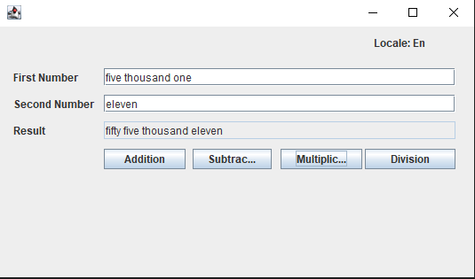
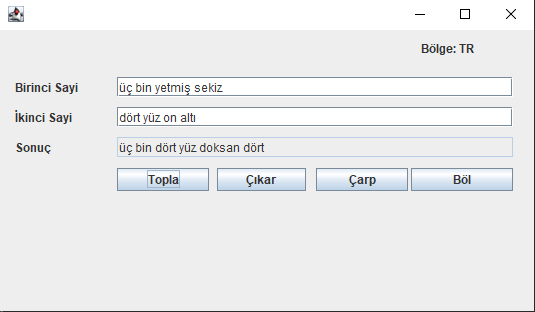

# calculator-OSGi

This is basic calculator but possible to write numbers as a word. 
It occurs two OSGi server which is ConverterProvider and ConverterConsumer. 
ConverterProvider responsible to convert word to number or number to word. 
ConverterConsumer shows user interface and makes calculations.

* Calculator has two languages option English and Turkish, defaultly Turkish.
* Swing used for user interface.

HERE some pictures of how calculator looks like. (Note: these inputs entered exemplarily).

-- English -- 

-- Turkish -- 

